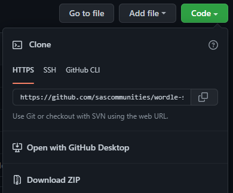

# Clone a SAS project from GitHub

In this exercise, we will use Git **clone** to bring an existing project from GitHub to a local repository. We'll then use the Git command line interface (and/or GitHub Desktop or VS Code) to explore this project. Finally, we will open the project files in our favorite SAS tools and view the contents and the Git integration.

1. Launch Git Bash and **cd** to the root folder for your Git projects (wherever you want to work).

2. In a web browser, navigate to https://github.com/sascommunities and find the **wordle-sas** project. Use the Code dropdown to find the HTTPS address to use to clone this project.

   

3. Use the **git clone** command to make a local copy of a public GitHub repository. You'll use **git clone** and paste the URL you copied. But here it is all together for you:
   ```
   git clone https://github.com/sascommunities/wordle-sas.git
   ```
   This will create a **new ** folder with the name of the project, and place repository contents inside of it.

## Open the repository with a SAS tool

In this section we'll open the cloned local repo with one of our favorite SAS coding interfaces. Here we'll show SAS Enterprise Guide (v8.2 or 8.3 for best results), SAS Studio v3.8 (Basic edition installed locally), and VS Code.