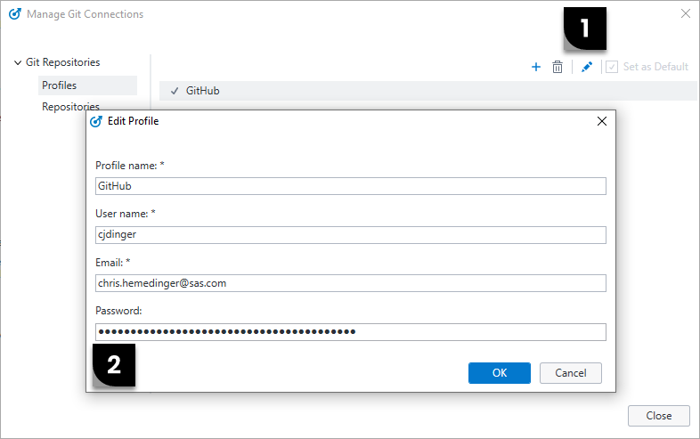

# Connect SAS Enterprise Guide to your Git profile

SAS Enterprise Guide supports only the HTTPS to connect to a Git server. This means you will need to supply a username and password.

**Notes:**

 * We don't want to supply our *real* password in the SAS Enterprise Guide settings, but systems like GitHub and GitLab allow for Personal Access Tokens -- a special token that acts like a password but you can scope its access, set an expiration, and revoke it at any time.

 * If you have 2-factor authentication set up, or single-signon through your org, then you **must** use a Personal Access Token to connect.

 * [Read more about Personal Access Tokens here](https://docs.github.com/en/authentication/keeping-your-account-and-data-secure/creating-a-personal-access-token) (GitHub).

 * Your authenticated connection is important for certain operations. These include Push and any access to private (non-public) repositories. The authentication isn't needed for local operations like Commit, Stage, and even Clone (for public repositories).

## Setting up a GitHub connection

**Before you add your profile:**
>First, you must use the GitHub site to define a personal access token by following [GitHub's instructions](https://docs.github.com/en/authentication/keeping-your-account-and-data-secure/creating-a-personal-access-token) .

>You must copy your token to the clipboard, and I recommend saving it somewhere safe in a text file or secure note. GitHub will not show you the value again!

To create a profile in SAS Enterprise Guide, select Tools->Manage Git Connections. Specify a Profile name (ex: GitHub), username (your GitHub id), email and password (your personal access token).

