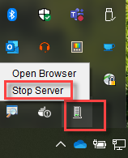
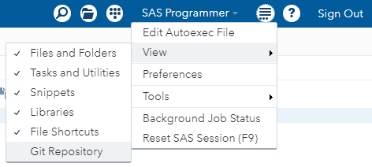
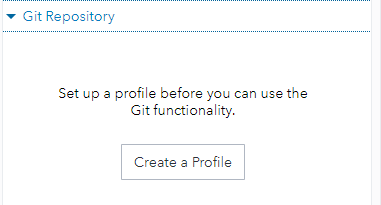
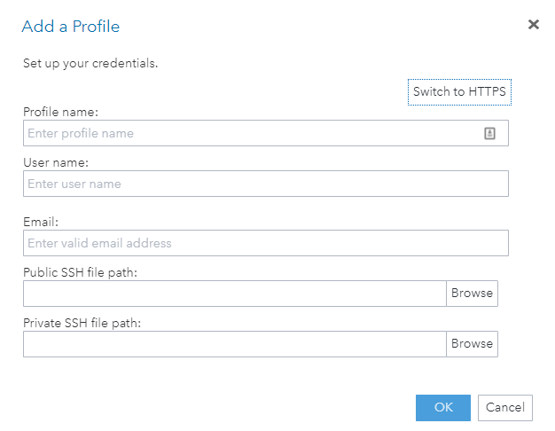
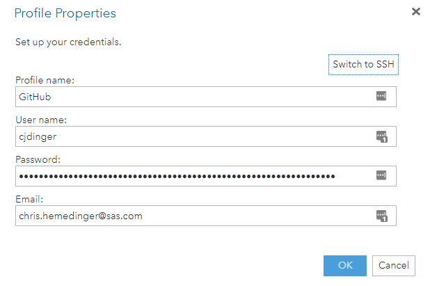

# Connect SAS Studio to your Git profile

SAS Studio supports only SSH and HTTPS to connect to a Git server. In this exercise we use HTTPS, so you will need to supply a username and password.

**Notes:**

 * We don't want to supply our *real* password in the SAS Studio settings, but systems like GitHub and GitLab allow for Personal Access Tokens -- a special token that acts like a password but you can scope its access, set an expiration, and revoke it at any time.

 * If you have 2-factor authentication set up, or single-signon through your org, then you **must** use a Personal Access Token to connect.

 * [Read more about Personal Access Tokens here](https://docs.github.com/en/authentication/keeping-your-account-and-data-secure/creating-a-personal-access-token) (GitHub).

 * Your authenticated connection is important for certain operations. These include Push and any access to private (non-public) repositories. The authentication isn't needed for local operations like Commit, Stage, and even Clone (for public repositories).

## Setting up a GitHub connection

In SAS Studio v3.81 Basic, the HTTPS options are not enabled by default. We'll need to modify the config settings to allow it. This will require admin access to your machine (Program Files area).

Edit config.properties for SAS Studio, found in %PROGRAMFILES%\SASStudioSingleUser\3.81\war\config\config.properties. These are the lines to alter (both values should be **true**).
```
#--- for turning off Git username and password fields
webdms.showGitPassword=true
#--- for turning off Git functionality
webdms.allowGit=true
```
If SAS Studio is running (even as a server in your Windows tray), you'll need to exit and restart it for this to take effect.



**Before you add your profile:**
>First, you must use the GitHub site to define a personal access token by following [GitHub's instructions](https://docs.github.com/en/authentication/keeping-your-account-and-data-secure/creating-a-personal-access-token) .

>You must copy your token to the clipboard, and I recommend saving it somewhere safe in a text file or secure note. GitHub will not show you the value again!

## Setting up a GitHub connection

Make sure the Git Repositories view is enabled. Select View->Git Repositories from the top menu.



Expand the Git Repository tab and select Create a Profile



In the Add a Profile window, select **Switch to HTTPS**



In the HTTPS version of the window, specify a Profile name (ex: GitHub), username (your GitHub id), email and password (your personal access token). 




