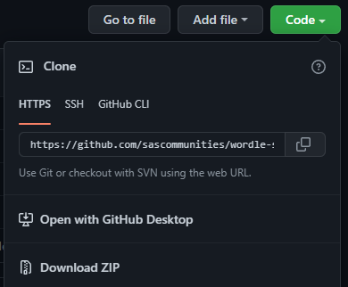
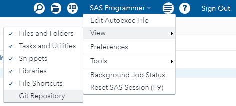

# Clone a SAS project from GitHub

In this exercise, we will use Git **clone** to bring an existing project from GitHub to a local repository. We'll then use the Git command line interface (and/or GitHub Desktop or VS Code) to explore this project. Finally, we will open the project files in our favorite SAS tools and view the contents and the Git integration.

1. Launch Git Bash and **cd** to the root folder for your Git projects (wherever you want to work).

2. In a web browser, navigate to https://github.com/sascommunities and find the **wordle-sas** project. Use the Code dropdown to find the HTTPS address to use to clone this project.

   

3. Use the **git clone** command to make a local copy of a public GitHub repository. You'll use **git clone** and paste the URL you copied. But here it is all together for you:
   ```
   git clone https://github.com/sascommunities/wordle-sas.git
   ```
   This will create a **new ** folder with the name of the project, and place repository contents inside of it.

   Change directory (cd) to the new folder:
   ```
   cd ./wordle-sas
   ```

4. Check repo history using the **git log** command.
    ```
    git log --pretty=format:"%h %ae %s"
    ```
    The **pretty** option specifiers can make a more concise, readable history log with certain fields. Or use the **--oneline** option for a quick view:
    ```
    git log --oneline
    ```

## Open the repository with a SAS tool

In this section we'll open the cloned local repo with one of our favorite SAS coding interfaces. Here we'll show SAS Enterprise Guide (v8.2 or 8.3 for best results), SAS Studio v3.8 (Basic edition installed locally), and VS Code.

### SAS Enterprise Guide

**Note:** *Before* you can add a repository to SAS Enterprise Guide, you must create at least one Git profile definition.

Select the Git Repositories tab from the View menu or from the side bar, and then click **Add**.


Use the Add a Repository window to specify the folder of your local repo path. Do not specify anything in the Repository field (that's for cloning).


Once added, use the repository view to explore.


## SAS Studio 3.81

**Notes:** 

* *Before* you can add a repository to SAS Enterprise Guide, you must create at least one Git profile definition.
* Git profiles are not enabled in SAS Studio within SAS OnDemand for Academics. These steps require SAS Studio v3.81 Basic (local) or Enterprise in your org (where an admin has allowed Git profiles).

Make sure the Git Repositories view is enabled. Select View->Git Repositories from the top menu.



Click Open a Local Repository, and navigate to the local folder for your project.


Explore the repository history.


## VS Code

Since we are already in the Git Bash window, the easiest way to launch VS Code for this project is from the command line:
```
code .
```
which will open a VS Code window for the current folder.

Use the Timeline tab to explore the Git history for the project.


