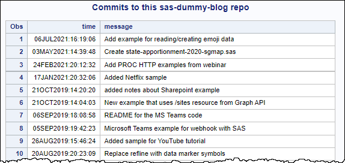

# Using Git functions in SAS programming

> **Reference**: [Documentation for Git functions in SAS](https://go.documentation.sas.com/doc/en/pgmsascdc/9.4_3.5/lefunctionsref/n1mlc3f9w9zh9fn13qswiq6hrta0.htm)

Git functions were added to the SAS programming language in SAS 9.4M6 and SAS Viya 3.5. They can work in any SAS programming environment including:

* Base SAS (display manager)
* SAS Enterprise Guide (any version connected to SAS 9.4M6 or later)
* SAS Studio v3.8 (including SAS OnDemand for Academics)
* SAS Studio in SAS Viya (any version)
* Batch SAS

These GITFN* functions were introduced in SAS 9.4 Maint 6 with a limited set of capability. They were expanded and **renamed** (to drop the "FN" suffix and other intuitive updates) in SAS Viya 3.5 and SAS 9.4 Maint 7. Some bug fixes too, along the way. So in these exercises we present what works in specific environments -- all of which can be very useful!

## Using SAS OnDemand for Academics (or any 9.4M6 environment)

### Example 1. Clone a repo and run the code
Run this code in the environment to:

* clone the wordle-sas repository
* %include a program file from that repo in your session
* "play Wordle" by using the macros defined in that program!

```
/* Clone to a temp space -- I don't even need to know where */
options dlcreatedir;
%let repoPath = %sysfunc(getoption(WORK))/wordle-sas;
libname repo "&repoPath.";
libname repo clear;
 
/* Fetch latest code from GitHub */
data _null_;
 rc = gitfn_clone(
   "https://github.com/sascommunities/wordle-sas.git",
   "&repoPath.");
 put rc=;
 
run;

options source2;
/* run the code in this session */
%include "&repoPath./wordle-sas.sas";

/* Start the game and first guess */
%startGame;
%guess(adieu);

/* use %guess macro one at a time to add more guesses! */
```


### Example 2. Clone a repo and explore its commit history

Run this code in the environment to clone a repo, get the count of the commit log and list details of those commits. 

```
/* Clone to a temp space -- I don't even need to know where */
options dlcreatedir;
%let repoPath = %sysfunc(getoption(WORK))/sas-dummy-blog;
libname repo "&repoPath.";
libname repo clear;
 
/* Fetch latest code from GitHub */
data _null_;
 rc = gitfn_clone(
   "https://github.com/sascommunities/sas-dummy-blog.git",
   "&repoPath.");
 put rc=;
run;

data commits (keep=time message);
  length time_char $ 100 time 8 message $ 100 n 8;
  n = gitfn_commit_log("&repoPath.");
  format time datetime20.;

  do i=1 to n;
    rc = gitfn_commit_get(i,"&repoPath.",'message',message);
    rc = gitfn_commit_get(i,"&repoPath.",'time',time_char);
    time = trim(time_char);
    time = time + "01jan1970 0:0:0"dt;
    output;
  end;
run;

title "Commits to this sas-dummy-blog repo";
proc print data=commits;
run;
title;
 
/* Run a program from the repo */
options source2;
/* run the code in this session */
%include "&repoPath./rng_example_thanos.sas";
```



## Using SAS Viya or SAS 9.4 Maint 7 or later

### Example 3. Initialize a new repo, add content, commit and push

This one is more involved and works only in later versions of SAS. You'll see the new function names in the code.

To run this exercise with public GitHub, we need to create an empty public repo in a GitHub account.


You also need a way to connect from SAS to GitHub. Username and Personal Access Token is the easiest way. [This is how to create a Personal Access Token on GitHub](https://docs.github.com/en/authentication/keeping-your-account-and-data-secure/creating-a-personal-access-token).

```
%let path = local-path-to-make-a-folder;
%let email=your-email@domain.com;
%let remote = https://github.com/your-user-id/added-by-sas.git;

/* user ID and personal access token for GitHub*/
%let gituser = your-user-id;
%let gitpac = your-personal-access-token;

/* Trick to create a new folder */
options dlcreatedir;
libname repo "&path";
libname repo clear;

data _null_;
rc = git_init_repo("&path", "&remote");
put "Created repo " rc=;
run;

filename readme "&path./README.md";
data _null_;
file readme;
put "# Made by SAS";
put "This Git project was built using SAS code";
run;

data _null_;
rc = git_index_add("&path","README.md","new");
put "Staged README.md " rc=;
run;

data _null_;
rc = git_commit("&path","HEAD",
  "&gituser","&email",
   "Adding the README!");
put "Committed the change " rc=;
run;

data _null_;
rc = git_push("&path", "&gituser","&gitpac");
put "Pushed to GitHub! " rc=;
run;

```

Partial output:
```
65         
66         data _null_;
67         rc = git_push("&path", "&gituser","&gitpac");
68         put "Pushed to GitHub! " rc=;
69         run;

NOTE: Push successful!
Pushed to GitHub! rc=0
```
