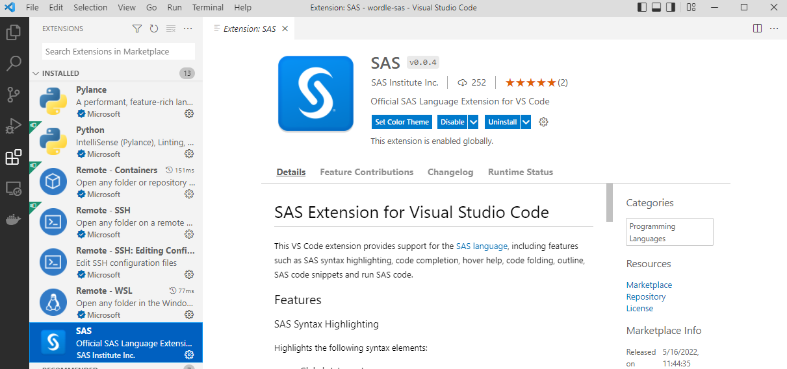
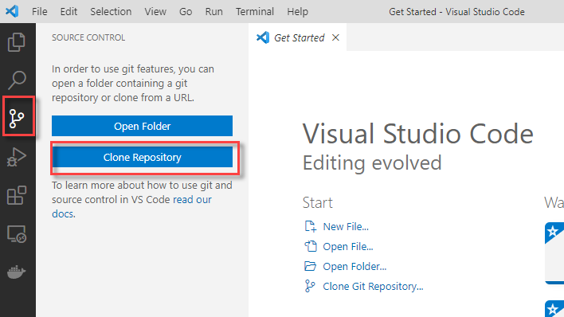
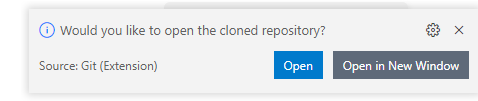
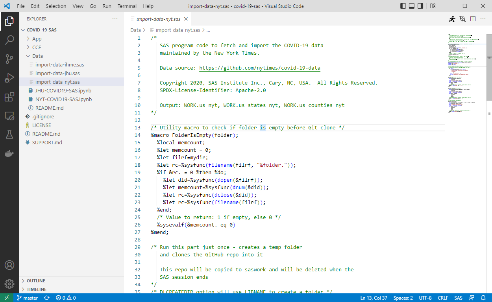

# Using VS Code to manage SAS projects

VS Code offers built-in support for Git and (**drum roll**) a brand new extension that supports the SAS programming language!

> [Find it on the VS Code marketplace](https://marketplace.visualstudio.com/items?itemName=SAS.sas-lsp)



After installing the extension, clone and explore a repository that contains SAS program files. This is a good one:
```
https://github.com/sassoftware/covid-19-sas.git
```



Once cloned, open the repo:



Then explore the .SAS files:




